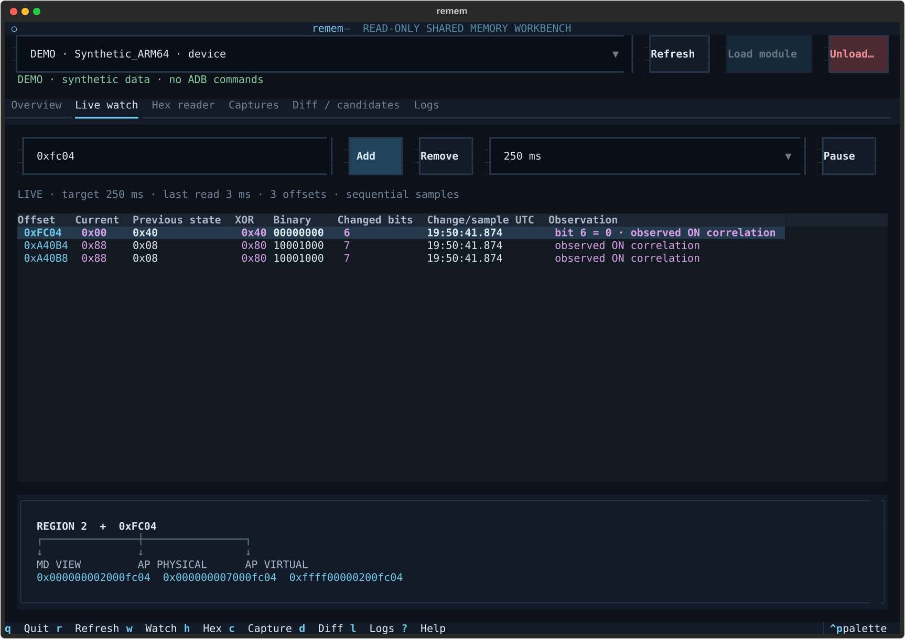

# remem

A read-only Android shared-memory workbench for Python 3.11+ and Textual.
It runs on the workstation and uses ADB to inspect a rooted ARM64 test device.



## Current delivery status

The desktop application is implemented, installs as `remem`, and has 48 passing
unit, mock-device, and headless TUI tests. Ruff lint/format and mypy checks pass.
The supplied workspace was empty: no original
`re_mem_region.c`, Makefile, real vendor headers, or `ghidra2live.py` was available.
The kernel implementation therefore has an **explicit ABI integration boundary**:
`kernel/re_mem_driver_abi.h` must be supplied from the actual driver definitions.
`re_mem_driver_abi.example.h` is an **unverified transcription of the conceptual
layout**, not a verified replacement for the real driver headers.

No Android device testing or kernel build has been performed. The development
host is macOS; the target workstation is Linux. Screenshots and the demo backend
are synthetic and are not evidence of device compatibility.

## Install and launch

On Linux, install Android platform-tools (`adb`), Python 3.11 or newer, and venv
support using your distribution's package manager. Then, from this directory:

```sh
python3 -m venv .venv
. .venv/bin/activate
python -m pip install -e '.[dev]'
remem --demo
```

The demo never runs ADB. Region addresses are synthetic; region 2 cycles through
the three supplied OFF/ON byte observations every three seconds. Use it to try
navigation and capture/diff tools before connecting hardware.

After completing the device setup below:

```sh
remem
```

No arguments launches the TUI. Configuration defaults to `./config.toml`;
relative module and capture paths resolve beside that config. Launch elsewhere
with `remem --config /absolute/path/config.toml`. If no config exists, built-in
defaults are used and automatic insertion remains disabled by the ABI check.
`NO_COLOR` is respected; use `env -u NO_COLOR remem` to explicitly enable colors
if your shell sets it. A 140×48 terminal gives room for the full instrument view;
smaller terminals use stacked status panels and scrolling. Tables scroll
horizontally for wide address columns.

## Integrate and build the kernel module

1. Provide the original module and driver headers. Verify the exact layout of
   `struct x`, `struct y`, and `struct THISGUY`, and the exact `getthisguy(int)`
   prototype against the vendor build. Verify whether `var4`/`var5` point to single
   regions or arrays and whether their bases already incorporate `offset`.
2. Create `kernel/re_mem_driver_abi.h`. Prefer including the real project headers.
   It must define the correctly typed `getthisguy_fn_t`, `struct THISGUY`, and
   `re_mem_driver_describe(guy, out)` which fills five `struct re_mem_region`
   entries. This accessor is the only driver-specific integration code; the
   example demonstrates the contract. Do not promote the example unchanged
   without verifying the actual ABI and borrowed mapping lifetime.
3. Use the **matching, configured Android kernel build tree**, generated headers,
   device configuration, `Module.symvers`, and the device's toolchain. Build on
   Linux, for example for a kernel supporting LLVM builds:

   ```sh
   make -C kernel KDIR=/absolute/path/to/device-kernel-build \
       ARCH=arm64 LLVM=1 ABI_VERIFIED=1
   ```

   For vendor GCC builds, use the exact corresponding `CROSS_COMPILE` prefix
   instead of `LLVM=1`. Follow the vendor's module build instructions for older
   Android trees. Module signing, SELinux policy, and kernel CFI requirements are
   device-specific and must be satisfied by that build.
4. Set `[module].local_path` to the resulting `.ko`, configure its remote path
   and module name if needed, and set `abi_verified = true` **only after the ABI
   and build match your device**. Restart remem after changing configuration.

The Makefile deliberately refuses a normal build until the header and
`ABI_VERIFIED=1` are supplied. This is an unfinished device-integration step,
not a compiler or symbol-resolution workaround. That flag does not validate an
ABI by itself.

The function must be a built-in text symbol in root-readable `/proc/kallsyms`.
The loader accepts one exact `T`/`t` match with a nonzero, aligned ARM64 kernel
address. It prints/notifies the address and boot ID, transfers the module,
rechecks the boot and symbol, and checks the boot again in the remote shell that
invokes `insmod`. It never guesses an address or persists one between boots.
If addresses are hidden, remem reports `kptr_restrict` and stops. It does not
change that sysctl or accept a manual guessed address.

If an older module is already loaded without the new sysfs API, remem reports
the missing interface and leaves it loaded. Deploying the update requires one
explicit unload/load or a device reboot. Thereafter, changing regions requires
only the sysfs selector.

## Device setup that remains manual

- Supply the original driver definitions and complete the matching kernel build.
- Enable USB debugging, connect the device, approve the workstation's ADB key,
  and grant your `su` implementation root access. `su -c` and `CAP_SYS_RAWIO`
  must work for this module.
- Satisfy any device-specific module signing, SELinux, or kernel build restrictions.
  remem reports permission failures and does not alter enforcement policies.
- If `/proc/kallsyms` hides the symbol, explicitly arrange live symbol visibility
  on your controlled test device. There is no automated sysctl modification.
- Select a serial when multiple devices are connected. Press the phone's power
  button yourself and capture the desired OFF/ON states.
- Unload only if you want to remove the module: the TUI asks for confirmation;
  the CLI requires typing `UNLOAD`. Quitting never unloads.

Once setup is complete, module loading is automatic when needed. The TUI checks
connection and status every five seconds, offers a serial selector, monitors boot
changes, and attempts automatic insertion once per device boot. After a failed
insertion, fix the reported issue and use Load Module to retry.
An explicit unload suppresses automatic insertion for the rest of this app
session and device boot; use Load Module to load it again.
Watch pauses on device/root/protocol errors; use Resume after recovery.

## Workbench

| View | What it does |
| --- | --- |
| Overview | Device/root/boot/kernel/module state, current region, known byte observations, region selector, address fan-out |
| Live watch | Add/remove offsets; current/previous/XOR/binary/bit changes/time; 100/250/500/1000 ms targets; pause/resume |
| Hex reader | Region/offset/length inputs; selectable rows, ASCII, selected-byte and change highlighting |
| Captures | Labels, OFF1/ON1 through OFF3/ON3 presets, full-region capture, metadata, capture inventory |
| Diff / candidates | Two-snapshot filters; three explicit OFF/ON pairs; ranked stable candidates; ±16/32/64/128 neighborhoods |
| Logs | Scrolling ADB operations and stderr, plus a separately filtered re_mem kernel log |

Shortcuts: `q` quit, `r` refresh, `1`–`5` region, `w` watch, `h` hex, `c` captures,
`d` diff, `l` logs, `?` help. Shortcuts apply outside text inputs; while editing,
letters and digits remain input. Click table rows (or use arrows and Enter) to
select offsets or regions. Use Overview's exact offset field to map a byte within
a hex row. New hex reads select the requested offset if the previous selection
is outside the read range.

The initial region-2 candidates are `0xFC04`, `0xA40B4`, and `0xA40B8`.
`0xFC04=0x40` is labeled **observed OFF correlation**, and `0x00` **observed ON
correlation**. These observations do not establish a guaranteed semantic field.
Watches are region-specific. TUI add/remove operations last for the session;
edit `[[candidate]]` entries in TOML for persistent defaults.

The watch retains the previous distinct byte, XOR, bits, and timestamp of the
last transition so it stays readable after subsequent unchanged samples. Magenta
highlighting expires after 1.5 seconds. Before any change, the timestamp is the
latest sample time. Sampling continues independently of this displayed history.

Digits alone are decimal: `64516` and `fc04` both mean `0xFC04`; `10` means ten,
so use `0x10` for hexadecimal sixteen. Negative values, invalid input, and reads
outside region bounds are rejected.

## CLI

Global options precede the subcommand:

```sh
remem status
remem status --json
remem --serial DEVICE_SERIAL regions
remem region 2
remem read 0xfc04
remem read 0xfc04 --length 64
remem read 0xfc04 --raw > byte.bin
remem watch 0xfc04 0xa40b4 0xa40b8 --interval 250
remem capture OFF1
remem diff OFF1 ON1 --filter single-bit
remem diff OFF1 ON1 --offset 0xfc04 --radius 32
remem candidates OFF1 ON1 OFF2 ON2 OFF3 ON3
remem logs
remem load
remem unload
remem tui
```

Diff and candidate commands work entirely offline. Labels must match exactly one
capture; if labels repeat, use exact `.bin` paths. Status and logs do not insert a
module. `--verbose` logs commands to stderr; raw read output stays binary.

Diff filters: `all`, `single-bit`, `0-to-1` (only rising bits), `1-to-0` (only
falling bits), and `boolean` (exact 0/1 or a single changed bit). Counts include
all matches; display defaults to 1,000 rows (`--limit` for CLI). Candidates require
stable OFF bytes and stable ON bytes across alternating pairs, with unequal OFF
and ON values. Ranking prioritizes exact 0/1 booleans, single bits, repeatability,
nearby changes, and stable aligned 16/32/64-bit little-endian neighborhoods. The
word patterns are evidence, not a claim about the driver's field types.

## Capture format and read guarantees

Files are named `regionN_LABEL_TIMESTAMP_UNIQUE.bin`, with a matching `.json`:

- `schema`, `device_serial`, `boot_id`, `timestamp` (UTC), `label`, `sha256`
- `region`: `region`, `size`, `md_phys`, `ap_phys`, `ap_virt`, `generation`

Temporary files publish the binary first and the JSON commit marker last.
Incomplete captures do not enter the inventory. Loading validates size,
metadata, and SHA-256. Comparisons require matching serial, boot, region, size,
and bases. A selector generation can differ between captures of the same region.
Failures are surfaced; corrupted or truncated snapshots are not compared.

Bounded reads use `adb exec-out` with root `dd if=/dev/re_mem bs=1 skip=O count=L`.
The kernel implements seeking, so large offsets need not be read and discarded.
Nearby watches coalesce (`0xA40B4` and `0xA40B8` share a five-byte read); the gap
to `0xFC04` is never dumped. Full captures use `cat /dev/re_mem`.

If your device's `dd` is incompatible, set `[memory].read_mode = "cat"` for the
known reliable full-region method. This mode is explicit; errors never trigger
silent full dumps. Read lengths and region metadata are checked before and after
every read. Reads and captures have a configurable byte limit (default 64 MiB)
and ADB timeout (default 30 seconds).

Sampling intervals are targets, not real-time guarantees. ADB/root/process
latency may exceed 100 or 250 ms; the watch displays actual read duration and does
not queue overlapping sample cycles. Snapshots and coalesced samples are
**sequential reads of live changing memory**, not atomic snapshots of modem/AP
state. Locking prevents mixed region bases and sizes, not writes by the original
driver/modem.

The kernel uses `memcpy_fromio()`, a region read/write semaphore, and a generation
check for each open descriptor. Switching regions waits for the active read,
then invalidates existing readers with `ESTALE`, preventing multi-read captures
from concatenating two regions. The misc device has mode `0400`, accepts only
read-only opens with `CAP_SYS_RAWIO`, and provides no write/ioctl/mmap path.
It never remaps or unmaps the vendor driver's borrowed mapping. That mapping
must remain alive while this module is loaded; confirm the vendor driver's
lifetime guarantee during ABI integration.

Sysfs API:

```text
/sys/class/misc/re_mem/region   decimal 1..5; root writes; invalid EINVAL / absent ENODEV
/sys/class/misc/re_mem/info     key=value current region metadata plus generation
/sys/class/misc/re_mem/regions  valid region blocks separated by a blank line
```

The address-bearing endpoints require `CAP_SYS_RAWIO`; they intentionally emit
explicit addresses for the controlled research tool. dmesg remains diagnostic
and is never the metadata API.

## Project layout

```text
.
├── kernel/
│   ├── re_mem_region.c
│   ├── re_mem_driver_abi.example.h
│   └── Makefile
├── remem/
│   ├── app.py / app.tcss
│   ├── adb.py / module.py / service.py
│   ├── models.py / regions.py / memory.py
│   ├── snapshots.py / diff.py / candidates.py
│   ├── config.py / cli.py / demo.py
│   ├── __init__.py / __main__.py
│   └── widgets/ (address map, hex renderer, dialogs)
├── tests/ (logic, mocked devices, Textual interaction)
├── scripts/render_demo.py
├── doc/ui-design-spec.md
├── doc/previews/ (*.svg)
├── captures/
├── config.toml
├── pyproject.toml
└── README.md
```

## Development and validation

```sh
python -m pytest -q
ruff check remem tests scripts
ruff format --check remem tests scripts
mypy remem
python scripts/render_demo.py
```

The mock tests check parsing, ranges, translations, XOR/bits, snapshot corruption,
repeatability, ADB device states, sysfs, boot changes, symbol rejection, existing
module reuse, bounded reads, and capture discard. TUI tests exercise dashboard,
watch edits, hex reads, region switches, capture/diff/candidate/neighborhood tools,
small-terminal navigation, and unload cancellation. Rendered previews use the
actual Textual widgets. Their synthetic values cannot validate a kernel ABI,
ADB behavior on your phone, timing on hardware, or mapping lifetime.

Design decisions and component registry are in `doc/ui-design-spec.md`, applying
the interface-design and ui-design-workflow skills to terminal constraints.
Implementation references: [Textual workers](https://textual.textualize.io/guide/workers/),
[Textual headless testing](https://textual.textualize.io/guide/testing/), and
[Linux sysfs documentation](https://www.kernel.org/doc/html/latest/filesystems/sysfs.html).
